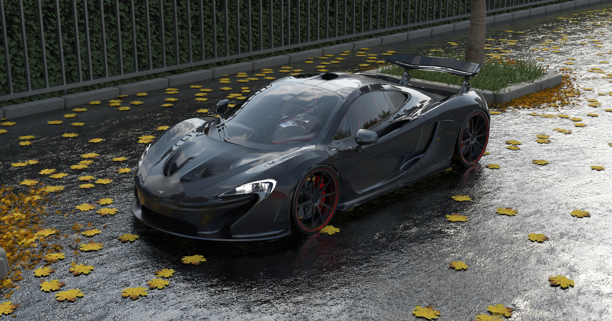
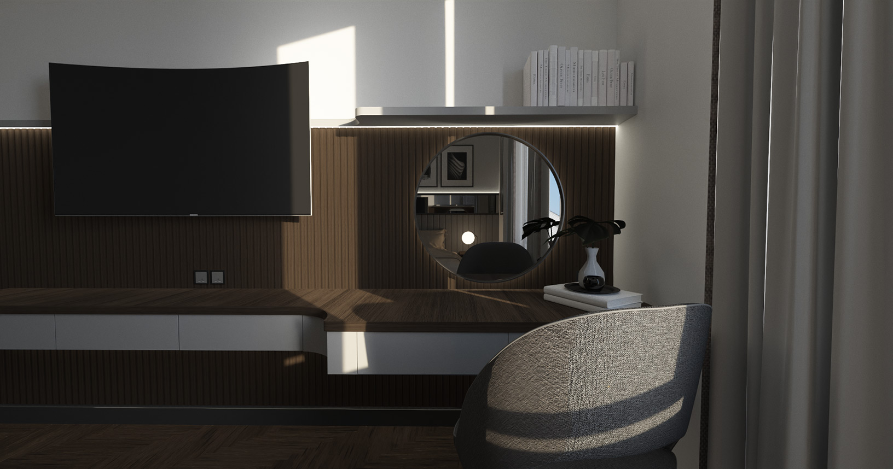
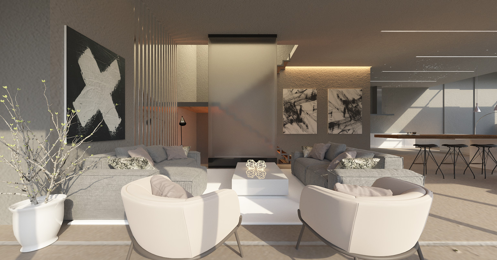
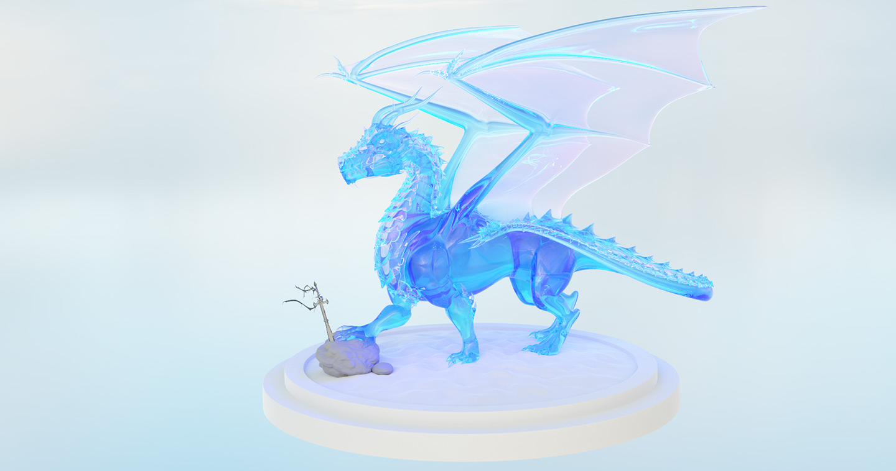
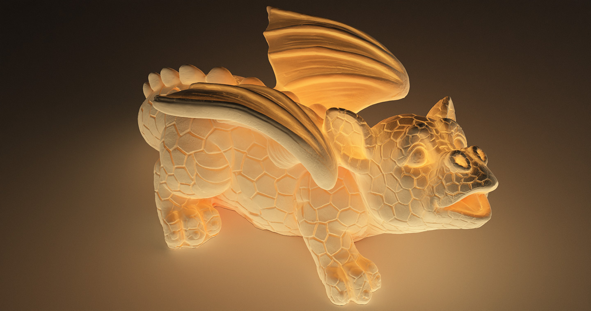

# HIPRT-Path-Tracer



Physically based Monte Carlo path tracer written with the [HIPRT](https://gpuopen.com/hiprt/) and [Orochi](https://gpuopen.com/orochi/) libraries.

HIPRT is AMD's equivalent to [OptiX](https://developer.nvidia.com/rtx/ray-tracing/optix). It allows the use of the ray tracing accelerators of RDNA2+ AMD GPUs and can run on NVIDIA devices as well (although it wouldn't take advatange of RT cores) as it is not AMD specific. 

The Orochi library allows the loading of HIP and CUDA libraries at runtime meaning that the application doesn't have to be recompiled to be used on a GPU from a different vendor (unlike HIP which would require a recompilation + linking).

# System requirements

- AMD RDNA1 GPU or newer (RX 5000 or newer) **or** NVIDIA Maxwell GPU or newer (GTX 700 & GTX 900 Series or newer)
- Visual Studio 2022 (only version tested but older versions might work as well) on Windows

# Features:

- Disney BSDF (Diffuse, fake subsurface, metallic, roughness, anisotropy + anisotropy rotation, clearcoat, sheen, glass, volumetric Beer-Lambert absorption, ...) [\[Burley, 2015\]](https://blog.selfshadow.com/publications/s2015-shading-course/#course_content)
	- For experimentation purposes, the BRDF diffuse lobe can be switched for either:
		- The original "Disney diffuse" presented in [\[Burley, 2012\]](https://disneyanimation.com/publications/physically-based-shading-at-disney/)
		- A lambertian distribution
		- The Oren Nayar microfacet diffuse model.
- Texture support for all the parameters of the BSDF
- BSDF Multiple Importance Sampling for Direct lighting
- Resampled Importance Sampling (RIS) + Weighted Reservoir Sampling (WRS) for many light sampling [\[Talbot, 2005\]](https://www.researchgate.net/publication/220852928_Importance_Resampling_for_Global_Illumination) + [\[M. T. Chao, 1982\]](https://www.jstor.org/stable/2336002)
- HDR Environment map + Multiple Importance Sampling using
	- CDF-inversion binary search
- Emissive geometry light sampling
- Nested dielectrics support 
	- Automatic handling as presented in [\[Ray Tracing Gems, 2019\]](https://www.realtimerendering.com/raytracinggems/rtg/index.html)
	- Handling with priorities as proposed in [\[Simple Nested Dielectrics in Ray Traced Images, Schmidt, 2002\]](https://www.researchgate.net/publication/247523037_Simple_Nested_Dielectrics_in_Ray_Traced_Images)
- Per-pixel adaptive sampling
- Normal mapping
- Interactive ImGui interface + interactive first-person camera
- Different frame-buffer visualisation (visualize the adaptive sampling map, the denoiser normals / albedo, ...)
- Use of the [\[ASSIMP\]](https://github.com/assimp/assimp) library to support [many](https://github.com/assimp/assimp/blob/master/doc/Fileformats.md) scene file formats.
- Optimized application startup time with:
	- Multithreaded texture loading
	- Asynchronous path tracing kernel compilation
	- Shader cache to avoid recompiling kernels unecessarily
- Intel [Open Image Denoise](https://github.com/RenderKit/oidn) + Normals & Albedo AOV support

### A more detailed explanation & showcase of the features can be found [here](README_data/Features/features.md).

# Building
## Prerequisites
### Windows
#### - AMD GPUs

Nothing to do, go to the "[**Compiling**](#compiling)" step.
#### - NVIDIA GPUs

To build the project on NVIDIA hardware, you will need to install the NVIDIA CUDA SDK v12.2. It can be downloaded and installed from [here](https://developer.nvidia.com/cuda-12-2-0-download-archive).

The CMake build then expects the CUDA_PATH environment variable to be defined. This should automatically be the case after installing the CUDA Toolkit but just in case, you can define it yourself such that CUDA_PATH/include/cuda.h is a valid file path.

### Linux

#### - AMD GPUs

1) Install OpenGL, GLFW and glew dependencies:

```sh
sudo apt install freeglut3-dev
sudo apt install libglfw3-dev
sudo apt install libglew-dev
```

2) Install AMD HIP (if you already have ROCm installed, you should have a `/opt/rocm` folder on your system and you can skip this step):

Download `amdgpu-install` package: https://www.amd.com/en/support/linux-drivers
Install the package: 

```sh
sudo apt install ./amdgpu-install_xxxx.deb
```

Install HIP: 

```sh
sudo amdgpu-install --usecase=hip
```

3) Normally, you would have to run the path tracer as `sudo` to be able to acces GPGPU compute capabilities. However, you can save yourself the trouble by adding the user to the `render` group and **rebooting your system** :

```sh
sudo usermod -a -G render $LOGNAME
```
#### - NVIDIA GPUs

1) Install OpenGL, GLFW and glew dependencies:

```sh
sudo apt install freeglut3-dev
sudo apt install libglfw3-dev
sudo apt install libglew-dev
```

2) Install the NVIDIA CUDA SDK (called "CUDA Toolkit"). It can be downloaded and installed from [here](https://developer.nvidia.com/cuda-downloads).
## Compiling

With the pre-requisites fulfilled, you now just have to run the CMake:

``` sh
git clone https://github.com/TomClabault/HIPRT-Path-Tracer.git --recursive
mkdir build
cd build
cmake ..
```

On Windows, a Visual Studio solution will be generated in the `build` folder that you can open and compile the project with (select `HIPRTPathTracer` as startup project).

On Linux, the executable will be generated in the `build` folder.

## Usage

`./HIPRT-Path-Tracer`

The following arguments are available:
- `<scene file path>` an argument of the commandline without prefix will be considered as the scene file. File formats [supported](https://github.com/assimp/assimp/blob/master/doc/Fileformats.md).
- `--sky=<path>` for the equirectangular skysphere used during rendering (HDR or not)
- `--samples=N` for the number of samples to trace (this argument is CPU-rendering only)
- `--bounces=N` for the maximum number of bounces in the scene (this argument is CPU-rendering only)
- `--w=N` / `--width=N` for the width of the rendering (this argument is CPU-rendering only)
- `--h=N` / `--height=N` for the height of the rendering (this argument is CPU-rendering only)

# Gallery







Sources of the scenes can be found [here](https://github.com/TomClabault/HIPRT-Path-Tracer/blob/main/README_data/img/scene%20credits.txt).
# License

GNU General Public License v3.0 or later

See [COPYING](https://github.com/TomClabault/HIPRT-Path-Tracer/blob/main/COPYING) to see the full text.
