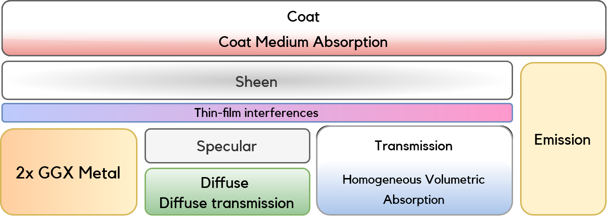
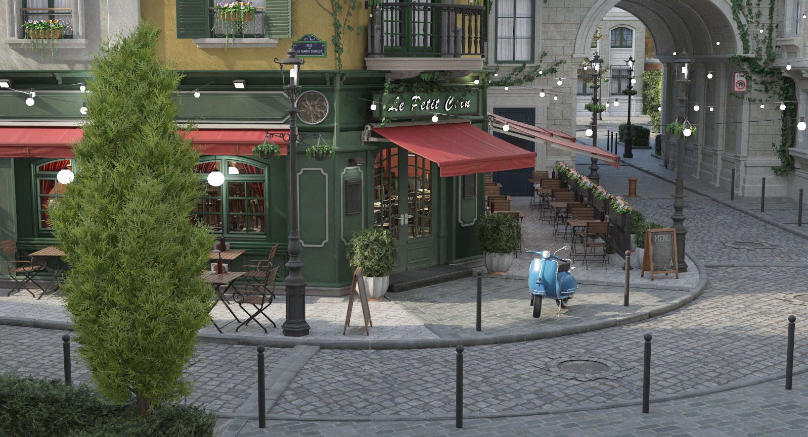

# HIPRT-Path-Tracer


Physically based unidirectional (backwards) monte carlo path tracer written with the [HIPRT](https://gpuopen.com/hiprt/) and [Orochi](https://gpuopen.com/orochi/) libraries.

HIPRT is AMD's equivalent to [OptiX](https://developer.nvidia.com/rtx/ray-tracing/optix). It allows the use of the ray tracing accelerators of RDNA2+ AMD GPUs and can run on NVIDIA devices as well (although it wouldn't take advatange of RT cores) as it is not AMD specific. 

The Orochi library allows the loading of HIP and CUDA libraries at runtime meaning that the application doesn't have to be recompiled to be used on a GPU from a different vendor (unlike HIP alone which, despite being compatible with NVIDIA and AMD hardware, would require a recompilation).

# System requirements

- AMD RDNA1 GPU or newer (RX 5000 or newer) **or** NVIDIA Maxwell GPU or newer (GTX 700 & GTX 900 Series or newer)
- Visual Studio 2022 (only version tested but older versions might work as well) on Windows
- CMake
- CUDA for NVIDIA compilation
# Features:

### Layered Principled BSDF:
- Coat Microfacet GGX Layer + Anisotropy, Anisotropy Rotation, Medium Absorption & Thickness
- SGGX Volumetric Sheen Lobe LTC Fit [\[Zeltner, Burley, Chiang, 2022\]](https://tizianzeltner.com/projects/Zeltner2022Practical/)
- Specular Microfacet GGX Layer
- Oren-Nayar Diffuse BRDF Lobe
- Metallic Microfacet GGX Layer + Anisotropy & Anisotropy Rotation + Double Roughness [\[Kulla & Conty, 2017\]](https://blog.selfshadow.com/publications/s2017-shading-course/imageworks/s2017_pbs_imageworks_slides_v2.pdf)
- Specular transmission BTDF + Beer Lambert Volumetric Absorption: [\[Burley, 2015\]](https://blog.selfshadow.com/publications/s2015-shading-course/#course_content)
- Multiple-scattering energy compensation for conductors (double metal layer), dielectrics (tranmission layer) and glossy-diffuse (specular + diffuse layer) materials [\[Turquin, 2019\]](https://blog.selfshadow.com/publications/turquin/ms_comp_final.pdf)


### Sampling
- Light sampling:
	- Uniform light sampling for direct lighting estimation + MIS
	- Resampled Importance Sampling (RIS) [\[Talbot et al., 2005\]](https://www.researchgate.net/publication/220852928_Importance_Resampling_for_Global_Illumination)+ Weighted Reservoir Sampling (WRS) for many light sampling  + [\[M. T. Chao, 1982\]](https://www.jstor.org/stable/2336002)
	- ReSTIR DI [\[Bitterli et al., 2020\]](https://research.nvidia.com/labs/rtr/publication/bitterli2020spatiotemporal/)
		- Supports envmap sampling
		- Many bias correction weighting schemes for experimentations (1/M, 1/Z, MIS-like, Generalized Balance Heuristic, Pairwise MIS [\[Bitterli, 2022\]](https://digitalcommons.dartmouth.edu/dissertations/77/), Pairwise MIS with defensive formulation [\[Lin et al., 2022\]](https://research.nvidia.com/publication/2022-07_generalized-resampled-importance-sampling-foundations-restir))
		- Fused Spatiotemporal Reuse [\[Wyman, Panteleev, 2021\]](https://research.nvidia.com/publication/2021-07_rearchitecting-spatiotemporal-resampling-production)
		- Light Presampling [\[Wyman, Panteleev, 2021\]](https://research.nvidia.com/publication/2021-07_rearchitecting-spatiotemporal-resampling-production)
	- HDR Environment map + Multiple Importance Sampling using
		- CDF-inversion & binary search
		- Alias Table (Vose's O(N) construction [\[Vose, 1991\]](https://citeseerx.ist.psu.edu/document?repid=rep1&type=pdf&doi=f65bcde1fcf82e05388b31de80cba10bf65acc07))
	
- BSDF sampling:
	- MIS
	- Smith GGX Sampling:
		- Visible Normal Distribution Function (VNDF) [\[Heitz, 2018\]](https://jcgt.org/published/0007/04/01/)
		- Spherical caps VNDF Sampling [\[Dupuy, Benyoub, 2023\]](https://arxiv.org/abs/2306.05044)
### Other rendering features:
- Texture support for all the parameters of the BSDF
- Texture alpha transparency support
- Stochastic material opacity support
- Normal mapping
- Nested dielectrics support 
	- Automatic handling as presented in [\[Ray Tracing Gems, 2019\]](https://www.realtimerendering.com/raytracinggems/rtg/index.html)
	- Handling with priorities as proposed in [\[Simple Nested Dielectrics in Ray Traced Images, Schmidt, 2002\]](https://www.researchgate.net/publication/247523037_Simple_Nested_Dielectrics_in_Ray_Traced_Images)
- Per-pixel adaptive sampling
- Intel [Open Image Denoise](https://github.com/RenderKit/oidn) + Normals & Albedo AOV support
### UI
- Interactive ImGui interface
	- Asynchronous interface to guarantee smooth UI interactions even with heavy path tracing kernels
- Interactive first-person camera
- Different frame-buffer visualization (visualize the adaptive sampling heatmap, the denoiser normals / albedo, ...)
### Other features
- Use of the [\[ASSIMP\]](https://github.com/assimp/assimp) library to support [many](https://github.com/assimp/assimp/blob/master/doc/Fileformats.md) scene file formats.
- Multithreaded scene parsing/texture loading/shader compiling/BVH building/envmap processing/... for faster application startup times
- Background-asynchronous path tracing kernel pre-compilations
- Shader cache to avoid recompiling kernels unnecessarily
### Some of the features are (or will be) presented in more details in my [blog posts](https://tomclabault.github.io/blog/)!

# Building
## Prerequisites
### Windows
#### - AMD GPUs

Nothing to do, go to the "[**Compiling**](#compiling)" step.
#### - NVIDIA GPUs

To build the project on NVIDIA hardware, you will need to install the NVIDIA CUDA SDK v12.2. It can be downloaded and installed from [here](https://developer.nvidia.com/cuda-12-2-0-download-archive).

The CMake build then expects the `CUDA_PATH` environment variable to be defined. This should automatically be the case after installing the CUDA Toolkit but just in case, you can define it yourself such that `CUDA_PATH/include/cuda.h` is a valid file path.

### Linux

#### - AMD GPUs

1) Install OpenGL, GLFW and glew dependencies:

```sh
sudo apt install freeglut3-dev
sudo apt install libglfw3-dev
sudo apt install libglew-dev
```

2) Install AMD HIP (if you already have ROCm installed, you should have a `/opt/rocm` folder on your system and you can skip this step):

Download `amdgpu-install` package: https://www.amd.com/en/support/linux-drivers
Install the package: 

```sh
sudo apt install ./amdgpu-install_xxxx.deb
```

Install HIP: 

```sh
sudo amdgpu-install --usecase=hip
```

3) Normally, you would have to run the path tracer as `sudo` to be able to acces GPGPU compute capabilities. However, you can save yourself the trouble by adding the user to the `render` group and **rebooting your system** :

```sh
sudo usermod -a -G render $LOGNAME
```
#### - NVIDIA GPUs

1) Install OpenGL, GLFW and glew dependencies:

```sh
sudo apt install freeglut3-dev
sudo apt install libglfw3-dev
sudo apt install libglew-dev
```

2) Install the NVIDIA CUDA SDK (called "CUDA Toolkit"). It can be downloaded and installed from [here](https://developer.nvidia.com/cuda-downloads).
## Compiling

With the pre-requisites fulfilled, you now just have to run the CMake:

``` sh
git clone https://github.com/TomClabault/HIPRT-Path-Tracer.git --recursive
cd HIPRT-Path-Tracer
mkdir build
cd build
cmake -DCMAKE_BUILD_TYPE=Debug ..
```

On Windows, a Visual Studio solution will be generated in the `build` folder that you can open and compile the project with (select `HIPRTPathTracer` as startup project).

On Linux, the `HIPRTPathTracer` executable will be generated in the `build` folder.

## Usage

`./HIPRT-Path-Tracer`

The following arguments are available:
- `<scene file path>` an argument of the commandline without prefix will be considered as the scene file. File formats [supported](https://github.com/assimp/assimp/blob/master/doc/Fileformats.md).
- `--sky=<path>` for the equirectangular skysphere used during rendering (HDR or not)
- `--samples=N` for the number of samples to trace*
- `--bounces=N` for the maximum number of bounces in the scene*
- `--w=N` / `--width=N` for the width of the rendering*
- `--h=N` / `--height=N` for the height of the rendering*

\* CPU only commandline arguments. These parameters are controlled through the UI when running on the GPU.

# Gallery




Sources of the scenes can be found [here](https://github.com/TomClabault/HIPRT-Path-Tracer/blob/main/README_data/img/scene%20credits.txt).
# Live YouTube Demos

### Material Editor Demo
[](https://www.youtube.com/watch?v=LOVBwOoLVVQ "Material Editor Demo")
### OIDN AOVs Quality Comparison
[](https://www.youtube.com/watch?v=GnCi7K2w9go "OIDN AOVs Comparison")
### ReSTIR DI vs. RIS vs. MIS Showcase
[](https://www.youtube.com/watch?v=R6nkhSDoJ4U "ReSTIR DI vs. RIS vs. MIS Showcase")
# License

GNU General Public License v3.0 or later

See [COPYING](https://github.com/TomClabault/HIPRT-Path-Tracer/blob/main/COPYING) to see the full text.
