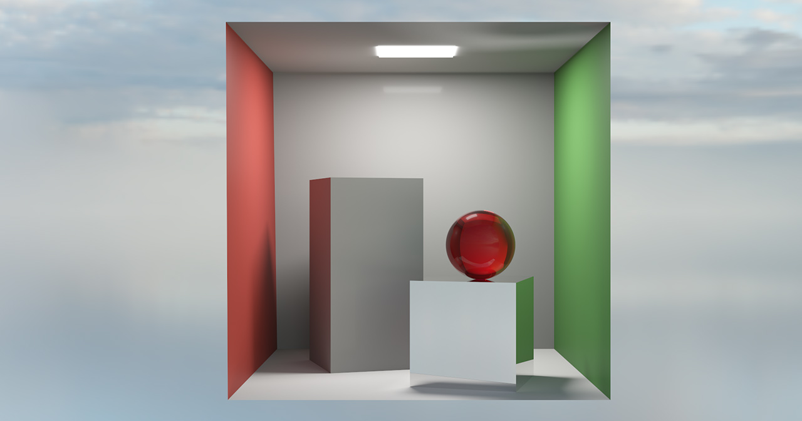
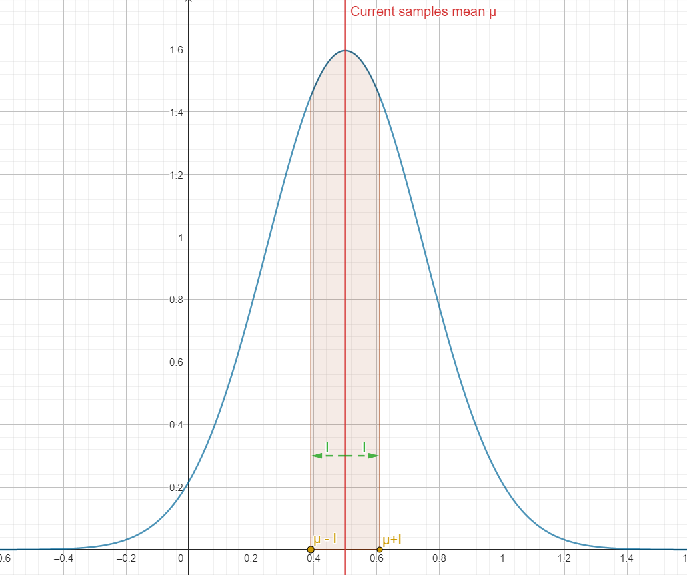
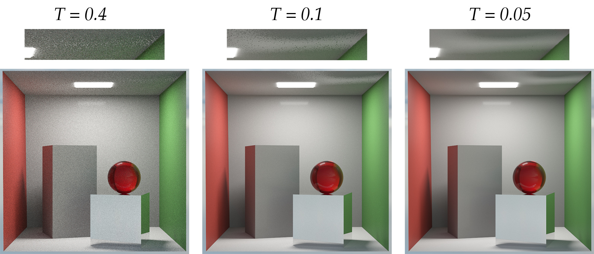
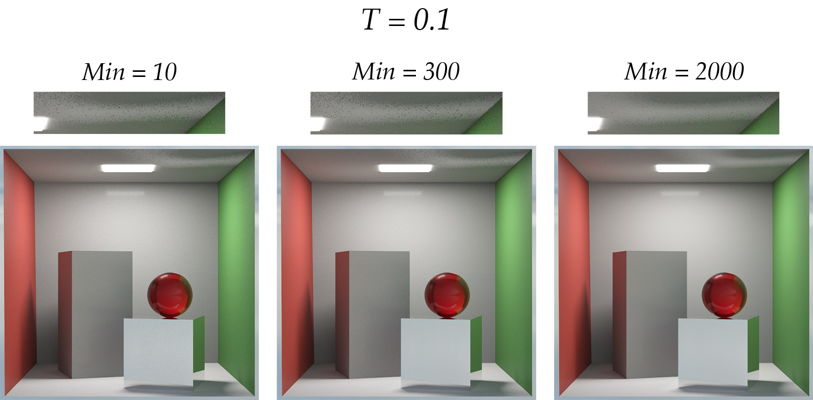
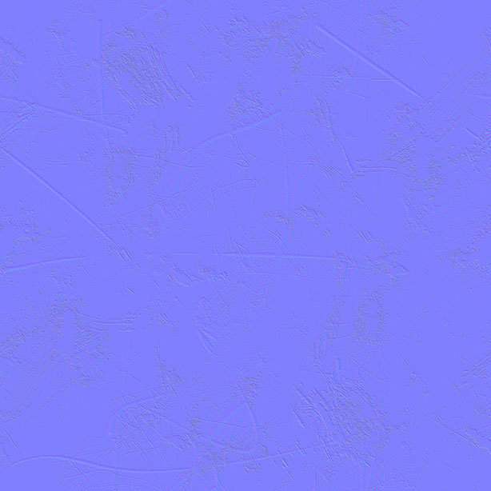
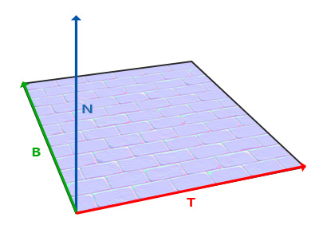
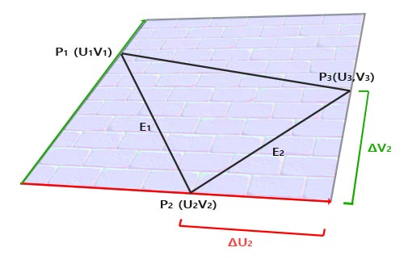

### TODO
- Disney BSDF (Diffuse, fake subsurface, metallic, roughness, anisotropy + anisotropy rotation, clearcoat, sheen, glass, volumetric Beer-Lambert absorption, ...) \[Burley, 2015\]
	- For experimentation purposes, the BRDF diffuse lobe can be switched for either:
		- The original "Disney diffuse" presented in [\[Burley, 2012\]](https://disneyanimation.com/publications/physically-based-shading-at-disney/)
		- A lambertian distribution
		- The Oren Nayar microfacet diffuse model.
### TODO
- Texture support for all the parameters of the BSDF
### TODO

- BSDF Direct lighting multiple importance sampling
### TODO

- HDR Environment map + importance sampling using
	- CDF-inversion binary search
### TODO
- Emissive geometry light sampling

### TODO
- Nested dielectrics support 
	- Automatic handling as presented in \[Ray Tracing Gems, 2019\]
	- Handling with priorities as proposed in \[Simple Nested Dielectrics in Ray Traced Images, Schmidt, 2002\]
### Per-pixel adaptive sampling

Adaptive sampling is a technique that allows focusing the samples on pixels that need more of them. This is useful because not all parts of a scene are equally complex to render.

Consider this modified cornell box for example:



Half of the rays of this scene don't even intersect any geometry and directly end up in the environment where the color of the environment map is computed. The variance of the radiance of these rays is very low since a given camera ray direction basically always results in the same radiance (almost) being returned.

However, the same cannot be said for the reflective caustic (the emissive light panel reflecting off the mirror small box) at the top right of the Cornell box. A camera ray that hits this region of the ceiling then has a fairly low chance of bouncing in direction of the small box to then bounce directly in the direction of the light. This makes the variance of these rays very high which really slows down the converge of this part of the scene. As a result, we would like to shoot more rays at these pixels than at other parts of the scene.

Adaptive sampling allows us to do just that. The idea is to estimate the error of each pixel of the image, compare this estimated error with a user-defined threshold $T$ and only continue to sample the pixel if the pixel's error is still larger than the threshold.

A very simple error metric is that of the variance of the luminance $\sigma^2$ of the pixel. In practice, we want to estimate the variance of a pixel across the $N$ samples $x_k$ it has received so far. 

The variance of $N$ samples is usually computed as:
$$\sigma^2 = \frac{1}{N}\sum_{k=1}^N (x_k - \mu) ^2$$
However, this approach would imply keeping the average of each pixel's samples (which is the framebuffer itself so that's fine) as well as the values of all samples (that's not fine). Every time we want to estimate the error of a single pixel, we would then have to loop over all the previous samples to compute their difference with the average and get our variance $\sigma^2$. Keeping track of all the samples is infeasible in terms of memory consumption (that would be 2GB of RAM/VRAM for a mere 256 samples' floating-point luminance at 1080p) and looping over all the samples seen so far is computationally way too demanding.

The practical solution is to evaluate the running-variance of the $N$ pixel samples $x_k$:
$$\sigma^2 = \frac{1}{N - 1} \left(\sum_{k=1}^N x_k^2 - \left( \sum_{k=1}^N x_k \right)^2\right)$$
  *Note that due to the nature of floating point numbers, this formula can have some precision issues. [This](https://en.wikipedia.org/wiki/Algorithms_for_calculating_variance#Online_algorithm) Wikipedia article presents good alternatives.*

With the variance, we can compute a 95% confidence interval $I$:
$$I = 1.96 \frac{\sigma}{\sqrt{N}}$$
 This 95% confidence interval gives us a range around our samples mean $\mu$ and we can be 95% sure that, for the current number of samples $N$ and and their variance $\sigma$ that we used to compute this interval, the converged mean (true mean) of an infinite amount of samples is in that interval.


*Visualization of the confidence interval **I** (green arrows) around **µ**.*

Judging by how $I$ is computed, it is easy to see that as the number of samples $N$ increases or the variance $\sigma^2$ decreases (and thus $\sigma$ decreases too), $I$ decreases. 

That should make sense since as we increase the number of samples, our mean $\mu$ should get closer and closer to the "true" mean value of the pixel (which is the value of the fully converged pixel when an infinite amount of samples are averaged together). 

If $I$ gets smaller, this means for our $\mu$ that it also gets closer to the "true" mean and that is the sign that our pixel has converged a little more.



*As the number of samples increases (or as the computed variance decreases), **I** gets smaller, meaning that the true mean is closer to our current mean which in turn means that our pixel has converged a little more.*

Knowing that we can interpret $I$ as a measure of the convergence of our pixel, the question now becomes: 

**When do we assume that our pixel has sufficiently converged and stop sampling?**

We use that user-given threshold $T$ we talked about earlier! Specifically, we can assume that if:

$$I \leq T\mu$$
Then that pixel has converged enough for that threshold $T$. As a practical example, consider $T=0$. We then have:

``` math
\displaylines{I \leq T\mu \\ I \leq 0}
```
If $I =0$, then the interval completely collapses on $\mu$. Said otherwise, $\mu$ **is** the true mean and our pixel has completely converged. Thus, for $T=0$, we will only stop sampling the pixel when it has fully converged.

In practice, having $I=0$ is infeasible. After some experimentations a $T$ threshold of $0.1$ seems to target a visually very reasonable amount of noise. Any $T$ lower than that represents quite the overhead in terms of rendering times but can still provide some improvements on the perceived level of noise:


*Comparison of the noise level obtained after all pixels have converged and stopped sampling with a varying **T** threshold*

Now if you look at the render with $T=0.1$, you'll notice that the caustic on the ceiling is awkwardly noisier than the rest of the image. There are some "holes" in the caustic (easy to see when you compare it to the $T=0.05$ render).

This is an issue of the per-pixel approach used here: because that caustic has so much variance, it is actually possible that we sample a pixel on the ceiling 50 times (arbitrary number) without ever finding a path to the light. The sampled pixel will then remain gray-ish (diffuse color of the ceiling) instead of being bright because of the caustic. Our evaluation of the error of this pixel will then assume that it has converged since it has gone through 50 samples without that much of a change in radiance, meaning that it has a low variance, meaning that we can stop sampling it. 

But we shouldn't! If we had sampled it maybe 50 more times, we would have probably found a path that leads to the light, spiking the variance of the pixel which in turn would be sampled until the variance has attenuated enough so that our confidence interval $I$ is small again and gets below our threshold.

One solution is simply to increase the minimum number of samples that must be traced through a pixel before evaluating its error. This way, the pixels of the image all get a chance to show their true variance and can't escape the adaptive sampling strategy! 


*Impact of the minimum amount of samples to trace before starting evaluating adaptive sampling for the same **T** threshold.*

This is however a poor solution since this forces all pixels of the image to be sampled at least 100 times, even the ones that would only need 50 samples. This is a waste of computational resources.

A better way of estimating the error of the scene is presented in the "Hierarchical Adaptive Sampling" section.

Nonetheless, this naive way of estimating the error of a pixel can provide very appreciable speedups in rendering time:

 

The application also offers the possibility to visualize where the rays are being concentrated on the image thanks to a heatmap (based on the number of rays per pixel):


### TODO
- Hierarchical adaptive sampling

### Normal mapping
Normal mapping (or bump mapping) is a technique that aims at visually improving perceived geometric details without actually having the geometry for it. This is done through the use of normal maps which are textures that look like this:

<p align="center">
  
</p>

*An example normal map.*

Each pixel of this texture represents a perturbation of the geometric normal of the surface. Because the lighting of a surface strongly depends on its orientation (its normal), if the normal of the surface is altered, then the lighting will be too.

The three channels RGB of a pixel of the texture respectively represent the X, Y and Z coordinates of the perturbed normal. However, you cannot just read from the texture using texture coordinates and assume that the RGB values of the pixel you get is going to be 1:1 the new normal of your surface:
	- The pixel are in $[0, 1]$ (or $[0, 255]$ if your prefer) but a normal is in $[-1, 1]$
	- The normals of the texture are in their own coordinate space called tangent space. They are not in the same space as your model. They will have to be transformed.

Bringing the pixel from $[0, 1]$ to the tangent space normal in $[-1, 1]$ is fairly straightforward:

$$N_{TS} = Pixel * 2 - 1$$
The more interesting question is how to bring the normal from tangent space to the coordinate space of our model (and then the world) so that we can actually use our normal for the lighting calculations. To do that, we're going to need a transformation matrix, also called an ONB (Orthonormal Basis) in this case. This matrix will let us bring the tangent space normal to model space (a change of basis).

<p align="center">
  
</p>

*TBN vectors used for the ONB matrix calculation. Illustration from* [LearnOpenGL](https://learnopengl.com/Advanced-Lighting/Normal-Mapping).

But how do we find that matrix?

The matrix is going to be built from three vectors: $T$, $B$ and $N$. $T$ and $B$ are called the tangent and bitangent vectors (depicted in the figure above). They represent the $X$ and $Y$ coordinates of our tangent space. $N$ is the geometric normal of our surface (or smooth normal if you're using interpolated vertex normals), it is the $Z$ coordinate of our tangent space.

*Sidenote: you may have noticed that normal maps are blue-ish in general. This is due to the normals being mostly oriented towards the **Z** axis (which is the blue channel of the pixel) of the tangent space which is the normal of our surface. Since a normal map represents perturbations of the surface normal, it is expected that the normal map is going to be mostly the normal of our surface itself.*

The goal is then to find these $T$ and $B$ vectors. We know that these two vectors are aligned with the $U$ and $V$ directions of the texture respectively. If $p_0$, $p_1$ and $p_2$ are the three vertices in counter-clockwise order of the triangle that we intersected and that they have $UV_1=(u_1, v_1)$, $UV_2=(u_2, v_2)$ and $UV_3=(u_3, v_3)$ for texture coordinates respectively, we can define two of the edges $e_1$ and $e_2$ of our triangle simply as:

```math
\displaylines{e_1 = p_2-p_1 \\ e_2 = p_3-p_2}
```

*Sidenote again: Note that the **T** and **B** we're computing **need** to be aligned with the **U** and **V** directions of the texture. A generic algorithm ([Duff, 2017](https://graphics.pixar.com/library/OrthonormalB/paper.pdf) for example) for finding arbitrary tangent and bitangent vectors to a normal cannot be used here. The process of building the ONB for normal mapping here isn't the same as when building an ONB of the "shading space" for BSDF evaluation.*

Similarly, we can define the differences $\Delta UV_1$ and $\Delta UV_2$ in textures coordinates of these vertices:

```math
\displaylines{\Delta UV_1 = (\Delta U_1, \Delta V_1)=UV_2-UV_1 \\ \Delta UV_2 = (\Delta U_2, \Delta V_2) = UV_3-UV_2}
```

<p align="center">
  
</p>

***e1** and **e2** can be expressed in terms of **ΔU\*T** and **ΔV\*B**. Illustration from* [LearnOpenGL](https://learnopengl.com/Advanced-Lighting/Normal-Mapping).

These $\Delta UV_1$ and $\Delta UV_2$ can be understood as the edges $e_1$ and $e_2$ but expressed in the coordinate space of the texture, the $UV$ coordinate space. Because we know that $UV$ coordinates are aligned with the $T$ and $B$ vectors that we're looking for (remember the "TBN vectors used for the ONB matrix calculation" illustration), we can therefore express $e_1$ and $e_2$ in terms of $\Delta UV_1$, $\Delta UV_2$, $T$ and $B$:

```math
\displaylines{e_1 = T*\Delta U_1 + B*\Delta V_1 \\ e_2 = T*\Delta U_2 + B*\Delta V_2}
```

In matrix form, this can be written as:
```math  
\begin{bmatrix}
\uparrow & \uparrow \\
e_1 & e_2 \\
\downarrow & \downarrow
\end{bmatrix}
=
\begin{bmatrix}
\uparrow & \uparrow \\
T & B \\
\downarrow & \downarrow
\end{bmatrix}
\begin{bmatrix}
\Delta U_1 & \Delta U_2 \\
\Delta V_1 & \Delta V_2
\end{bmatrix}
```

We can then solve for $T$ and $B$ by multiplying by the inverse of the $\left[ \Delta U_1 \Delta U_2, \Delta V_1 \Delta V_2 \right]$ matrix:

```math  
\begin{bmatrix}
\uparrow & \uparrow \\
T & B \\
\downarrow & \downarrow
\end{bmatrix}
=
\begin{bmatrix}
\uparrow & \uparrow \\
e_1 & e_2 \\
\downarrow & \downarrow
\end{bmatrix}
\frac{1}{\Delta U_1\Delta V_2 -\Delta V_1\Delta U_2}
\begin{bmatrix}
\Delta V_2 & -\Delta U_2 \\
-\Delta V_1 & \Delta U_1
\end{bmatrix}
```

This stems from the fact that the inverse of a 2x2 matrix is given by:

```math  
\begin{bmatrix}
a & b \\
c & d
\end{bmatrix}^{-1}
=
\frac{1}{ad-bc}
\begin{bmatrix}
d & -b \\
-c & a
\end{bmatrix}
```

*Sidenote yet again: when the determinant $ad-bc$ of the matrix is equal to 0, we're getting a division by 0 in the fraction and we cannot compute the inverse of the matrix. This is why matrices that have a determinant equal to 0 cannot be inversed. Such a matrix is said to be singular.*

Our $T$ and $B$ vectors now computed, the TBN matrix that will allow us to pass from the normal of our normal map (tangent space) to the model-space is given by:

```math
Mat_{TBN} = 
\begin{bmatrix}
\uparrow & \uparrow & \uparrow \\
T & B & N \\
\downarrow & \downarrow & \downarrow
\end{bmatrix}
```

The final normal that we can use for our shading is thus:

$$N_{shading}=Mat_{TBN}*N_{TS}$$

TODO visual impact
### Interactive ImGui Interface & FPS Camera

When rendering on the GPU, an ImGui interface is available to help playing with the parameters of the path tracer.

The goal of the interface really is to allow experimentations in terms of performance and visual impact.


The GUI also offers a first-person camera to move around the scene:
- Right click to pan
- Left click for rotating the view
- Mouse wheel for zooming in/out
### Visualization

Again with the goal of experimenting and better understand what is happening under the hood, the "Display view" option in the ImGui interface under "Render settings" allows to change what the viewport is displaying. For example, The AOVs (Arbitrary Output Values, which are additional data fed to the denoiser to help it denoiser better) of the denoiser such as the normals and albedo color of the scene can be visualized (this can also serve for debugging and making sure everything is in order)


More visualization options are available (adaptive sampling heatmap as used in the [adaptive sampling section](#per-pixel-adaptive-sampling) is one of them), have a look at them in the app!

### ASSIMP

[ASSIMP](https://github.com/assimp/assimp) is a library that provides a uniform interface for parsing [many](https://github.com/assimp/assimp/blob/master/doc/Fileformats.md) different file formats. Although not all extensions of some important file formats are not supported (ASSIMP doesn't seem to be recognizing the PBR extension of OBJ ("aniso" keyword issue) files and doesn't support all GLTF 2.0 extensions for example), ASSIMP vastly improves the range of scene files supported by the application.

### TODO
 - Optimized application startup time with:
	- Multithreaded texture loading
	- Asynchronous path tracing kernel compilation
### TODO
- Intel Open Image Denoise + Normals & Albedo AOV support

## TODO

Filter functions
